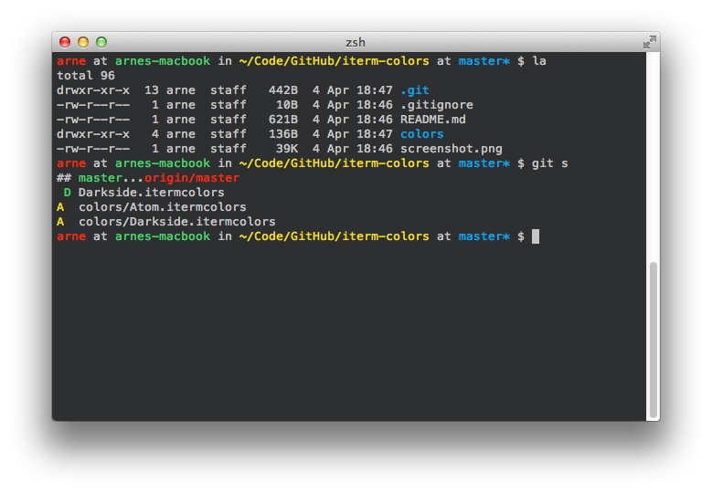
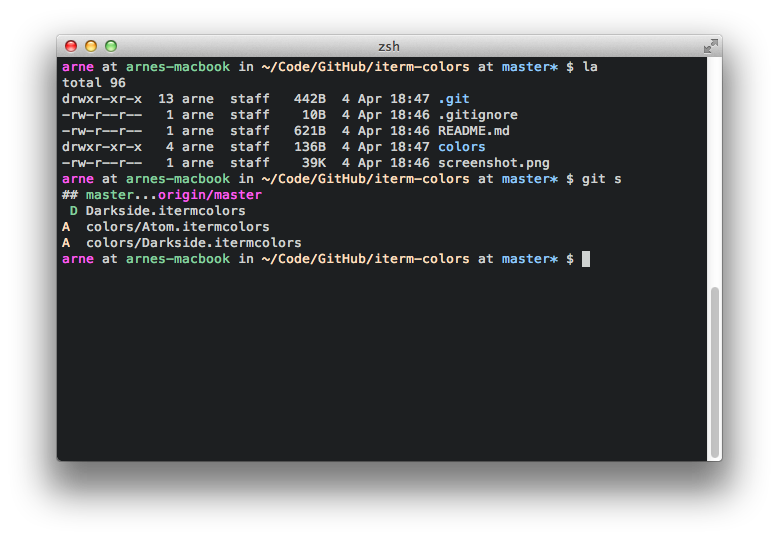
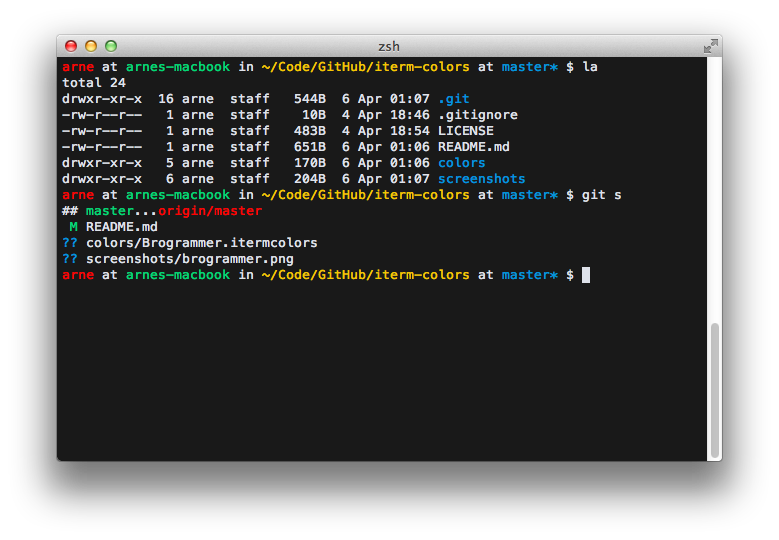
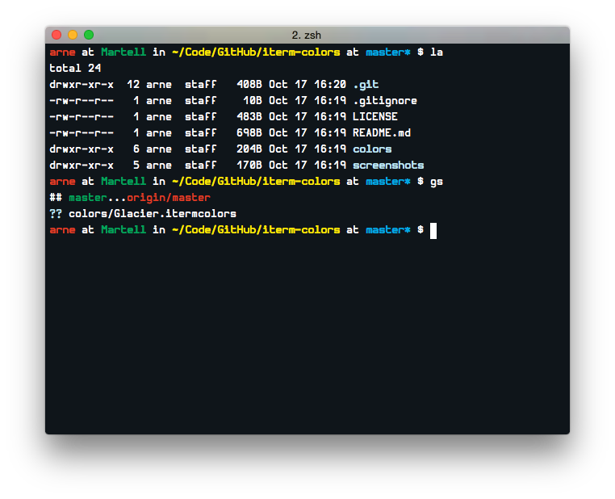
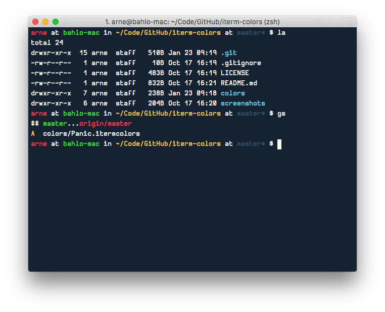

# iTerm Colors

A few iTerm color schemes, basically just ports of color schemes I like.

## Themes
### Darkside
This is a iTerm-port of the [Darkside theme](https://github.com/daylerees/colour-schemes).

### Atom
An iTerm-port of the default [Atom](https://atom.io) theme [Atom Dark Syntax](https://atom.io/packages/atom-dark-syntax).

### Brogrammer
An iTerm-port of the [Brogrammer theme](https://github.com/kenwheeler/brogrammer-theme)

### Glacier
An iTerm-port of the beautiful [Glacier theme](http://glaciertheme.com).

### Panic
An iTerm-port of the
[Panic terminal theme](https://twitter.com/panic/status/558389225612005376).

## License
Licensed under [WTFPL](LICENSE)
