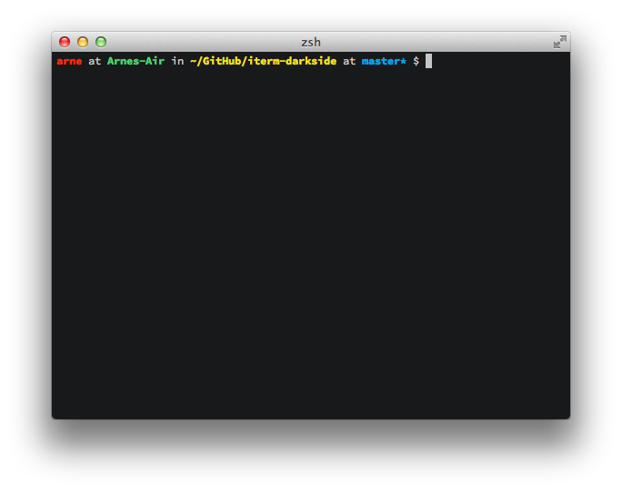

# iterm-darkside

This is a port of the [Darkside theme](https://github.com/daylerees/colour-schemes#darkside) for [iTerm](http://www.iterm2.com/).

## Screenshot

## Install
Get the `Darkside.itermcolors` and double-click it. Then, in your iTerm preferences, at `Profiles` select `Colors` select `Darkside` from `Load Presets…`.

**A small side-node:** The bright colors are just the dark ones with 20 % less saturation. If you want your bold colored text to be in the normal colors, uncheck `Draw bold text in bright colors` at the tab `Text`.

Have fun.
